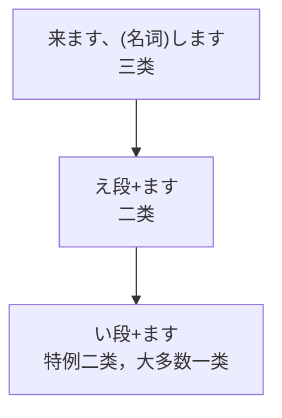

[ください](../9.sentence_pattern/ください.md)

| 分类   | 规则                                                               |
| ---- | ---------------------------------------------------------------- |
| 一类动词 | う段变同行い段 ==特例: くださる =>ください==                                   |
| 二类动词 | る                                                                |
| 三类动词 | する->します <ruby>来<rt>く</rt>る</ruby>-><ruby>来<rt>き</rt>ます</ruby> |

> [!summary]- 特例
> 1. <ruby>見<rt>み</rt>ます</ruby>
> 2. います
> 3. <ruby>起<rt>お</rt>きます</ruby>
> 4. <ruby>借<rt>か</rt>ります</ruby>  
> 5. <ruby>浴<rt>あ</rt>びます</ruby>
> 6. <ruby>降<rt>お</rt>ります</ruby>
> 7. <ruby>出<rt>で</rt>来<rt>き</rt>ます</ruby>  
>     ......

| |现在|过去|
|-|-|-|
|肯定|~ます|~ました|
|否定|~ません|ませんでした|
